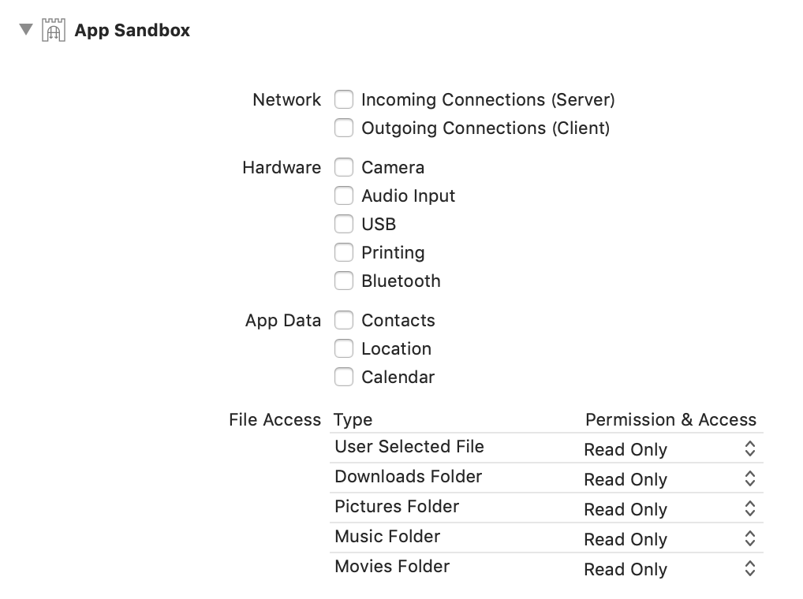

## Sandbox support
Sandbox-enabled applications cannot load from any directories other than those that have been preconfigured.

See the image below to see the directory where reading can be configured.



## User Selected File
In order to monitor directories other than the above, you need to set `Read Only` to `User Selected File` and implement the following.


```
func selectObserveDirectoryAndSaveBookmark() {
    // ref: https://stackoverflow.com/questions/12153504/accessing-the-desktop-in-a-sandboxed-app
    let openPanel = NSOpenPanel()
    openPanel.canChooseFiles = false
    openPanel.canChooseDirectories = true
    openPanel.canCreateDirectories = true
    openPanel.begin { [weak self] result in
        guard result.rawValue == NSFileHandlingPanelOKButton else { return }
        let bookmarks = openPanel.urls.compactMap { try? $0.bookmarkData(options: .withSecurityScope, includingResourceValuesForKeys: nil, relativeTo: nil) }
        let defaults = UserDefaults.standard
        defaults.set(bookmarks, forKey: "observe_bookmarks")
    }
}
```

```
func observeSelectedDirectories() {
    let defaults = UserDefaults.standard
    let bookmarks = (defaults.object(forKey: "observe_bookmarks") as? [Data]) ?? []
    let bookmarkURLs = bookmarks.compactMap { try? URL(resolvingBookmarkData: $0, options: .withSecurityScope, relativeTo: nil, bookmarkDataIsStale: nil) }
    bookmarkURLs.forEach { $0.startAccessingSecurityScopedResource() }
    let observer = ScreenShotObserver(searchDirectoryPaths: bookmarkURLs.compactMap { $0.relativePath })
    observer.delegate = self
    observer.start()
}
```
